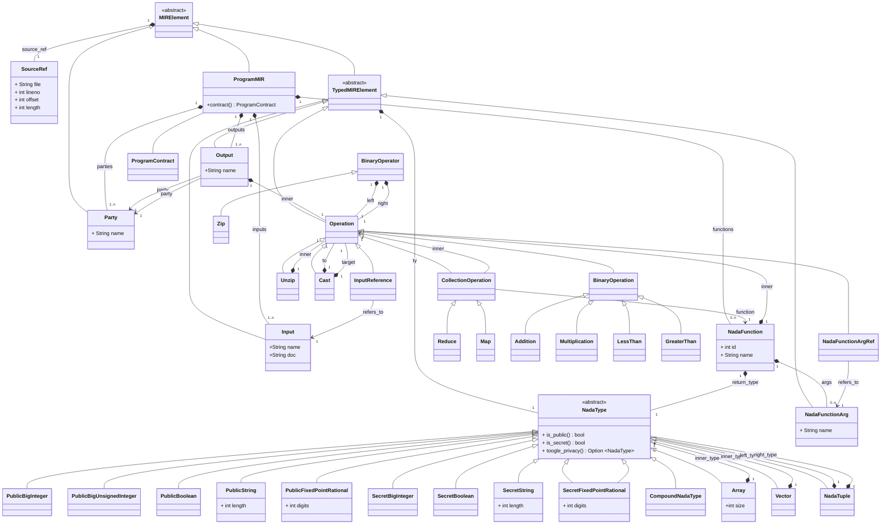

```mermaid
classDiagram
    
    class SourceRef {
        + String file
        + int lineno
        + int offset
        + int length
    }

    class MIRElement {
        <<abstract>>
    }
    MIRElement "1" *-- "1" SourceRef: source_ref
    MIRElement <|-- TypedMIRElement
    MIRElement <|-- ProgramMIR
    MIRElement <|-- Party
    
    class TypedMIRElement {
        <<abstract>>
    }
    TypedMIRElement "1" *-- "1" NadaType: ty
    TypedMIRElement <|-- Output
    TypedMIRElement <|-- Operation
    TypedMIRElement <|-- Input
    TypedMIRElement <|-- NadaFunctionArg

    class NadaType {
        <<abstract>>
        + is_public() bool
        + is_secret() bool
        + toogle_privacy() Option ~NadaType~
    }
    
    NadaType <|-- PublicBigInteger
    NadaType <|-- PublicBigUnsignedInteger
    NadaType <|-- PublicBoolean
    NadaType <|-- PublicString
    NadaType <|-- PublicFixedPointRational
    NadaType <|-- SecretBigInteger
    NadaType <|-- SecretBoolean
    NadaType <|-- SecretString
    NadaType <|-- SecretFixedPointRational
    NadaType <|-- SecretFixedPointRational
    NadaType <|-- CompoundNadaType
    NadaType <|-- Array
    NadaType <|-- Vector
    NadaType <|-- NadaTuple

    class PublicString {
        + int length
    }

    class PublicFixedPointRational {
        + int digits
    }

    class SecretString {
        + int length
    }

    class SecretFixedPointRational {
        + int digits
    }
    
    class Array {
        +int size
    }
    Array "1" *-- "1" NadaType: inner_type
    Vector "1" *-- "1" NadaType: inner_type
    NadaTuple "1" *-- "1" NadaType: left_type
    NadaTuple "1" *-- "1" NadaType: right_type

    ProgramMIR "1" *-- "1..n" Party: parties
    ProgramMIR "1" *-- "1..n" Input: inputs
    ProgramMIR "1" *-- "1..n" Output: outputs
    
    class Party {
        + String name
    }

    class Output {
        +String name
    }
    Output --> "1" Party: party
    Output "1" *-- "1" Operation: inner

    class Input {
        +String name
        +String doc
    }
    Output --> "1" Party: party

    ProgramMIR "1" *-- "0..n" NadaFunction: functions
    
    class NadaFunction {
        + int id
        + String name
    }
    NadaFunction "1" *-- "1" Operation: inner
    NadaFunction "1" *-- "0..n" NadaFunctionArg: args 
    NadaFunction "1" *-- "1" NadaType: return_type
    
    class NadaFunctionArg {
        + String name
    }
    
    Operation <|-- BinaryOperation
    BinaryOperator "1" *-- "1" Operation: left
    BinaryOperator "1" *-- "1" Operation: right
    
    Operation <|-- CollectionOperation
    CollectionOperation --> "1" NadaFunction: function
    CollectionOperation --> "1" Operation: inner
    

    CollectionOperation <|-- Reduce
    CollectionOperation <|-- Map
    Operation <|-- Unzip
    BinaryOperator <|-- Zip
    BinaryOperation <|-- Addition
    BinaryOperation <|-- Multiplication
    BinaryOperation <|-- LessThan
    BinaryOperation <|-- GreaterThan
    Operation <|-- Cast
    Operation <|-- InputReference
    Operation <|-- NadaFunctionArgRef
    
    Unzip "1" *-- "1" Operation: inner
    Cast "1" *-- "1" Operation: to
    Cast "1" *-- "1" Operation: target
    InputReference --> "1" Input: refers_to
    NadaFunctionArgRef --> "1" NadaFunctionArg: refers_to
    
    class ProgramMIR {
        +contract() ProgramContract
    }
    
    ProgramMIR -- ProgramContract
   
```