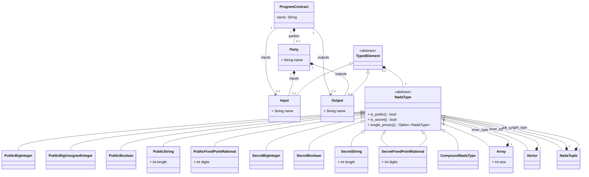

```mermaid
classDiagram
    
    class ProgramContract {
        name: String
    }
        
    ProgramContract "1" *-- "0..n" Party: parties
    ProgramContract "1" --> "0..n" Input: inputs
    ProgramContract "1" --> "0..n" Output: outputs
    
    class Party {
        + String name
    }
    
    Party "1" *-- "0..n" Input: inputs
    Party "1" *-- "0..n" Output: outputs
    
    class TypedElement {
        <<abstract>>
    }
    TypedElement "0..n" *-- "1" NadaType
    TypedElement <|-- Input
    TypedElement <|-- Output

    class NadaType {
        <<abstract>>
        + is_public() bool
        + is_secret() bool
        + toogle_privacy() Option ~NadaType~
    }
    NadaType <|-- PublicBigInteger
    NadaType <|-- PublicBigUnsignedInteger
    NadaType <|-- PublicBoolean
    NadaType <|-- PublicString
    NadaType <|-- PublicFixedPointRational
    NadaType <|-- SecretBigInteger
    NadaType <|-- SecretBoolean
    NadaType <|-- SecretString
    NadaType <|-- SecretFixedPointRational
    NadaType <|-- SecretFixedPointRational
    NadaType <|-- CompoundNadaType
    NadaType <|-- Array
    NadaType <|-- Vector
    NadaType <|-- NadaTuple

    class PublicString {
        + int length
    }

    class PublicFixedPointRational {
        + int digits
    }

    class SecretString {
        + int length
    }

    class SecretFixedPointRational {
        + int digits
    }

    class Array {
        + int size
    }
    
    Array "1" *-- "1" NadaType: inner_type
    Vector "1" *-- "1" NadaType: inner_type
    NadaTuple "1" *-- "1" NadaType: left_type
    NadaTuple "1" *-- "1" NadaType: right_type

    class Input {
        + String name
    }

    class Output {
        + String name
    }
    
```