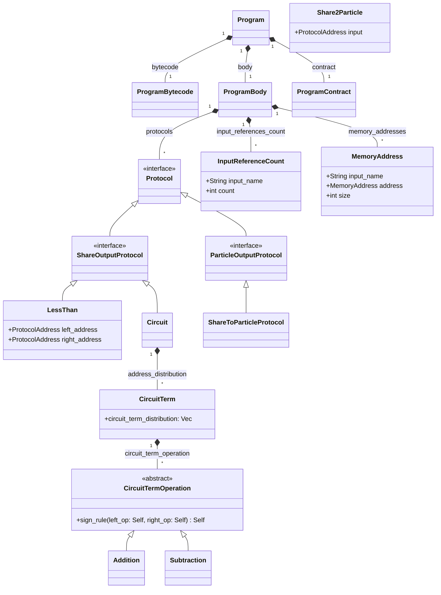

```mermaid
classDiagram

    Program "1" *-- "1" ProgramBytecode: bytecode
    Program "1" *-- "1" ProgramBody: body
    Program "1" *-- "1" ProgramContract: contract

    ProgramBody "1" *-- "*" Protocol: protocols
    ProgramBody "1" *-- "*" InputReferenceCount: input_references_count
    ProgramBody "1" *-- "*" MemoryAddress: memory_addresses

    class MemoryAddress {
        +String input_name
        +MemoryAddress address
        +int size
    }

    class InputReferenceCount {
        +String input_name
        +int count
    }

    class Protocol {
        <<interface>>
    }

    Protocol <|-- ShareOutputProtocol
    class ShareOutputProtocol {
        <<interface>>
    }

    Protocol <|-- ParticleOutputProtocol
    class ParticleOutputProtocol {
        <<interface>>
    }

    class LessThan {
        +ProtocolAddress left_address
        +ProtocolAddress right_address
    }

    class Share2Particle {
        +ProtocolAddress input
    }

    ParticleOutputProtocol <|-- ShareToParticleProtocol
    ShareOutputProtocol <|-- LessThan
    ShareOutputProtocol <|-- Circuit


    Circuit "1" *-- "*" CircuitTerm: address_distribution

    class CircuitTerm {
        +circuit_term_distribution: Vec<MemoryAddress>
    }

    CircuitTerm "1" *-- "*" CircuitTermOperation: circuit_term_operation

    class CircuitTermOperation {
        <<abstract>>
        +sign_rule(left_op: Self, right_op: Self) Self
    }

    CircuitTermOperation <|-- Addition
    CircuitTermOperation <|-- Subtraction

```