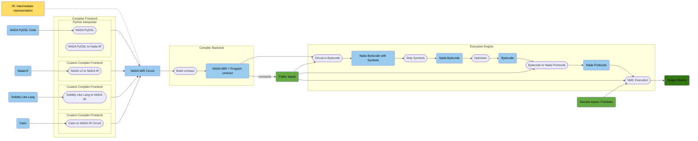

```mermaid

flowchart LR
    
    NadaPyDSLCode(NADA PyDSL Code) --> NadaPyDSL
    style NadaPyDSLCode fill:#9ce,color:#000
    NadaV2Code(NadaV2) --> NadaV2-to-NadaIR
    style NadaV2Code fill:#9ce,color:#000
    SolidityCode(Solidity Like Lang) --> Solidity2Nada
    style SolidityCode fill:#9ce,color:#000
    Cairo2Code(Cairo) --> Cairo2Nada
    style Cairo2Code fill:#9ce,color:#000
    
    subgraph Compiler Frontend
        direction TB
        subgraph PyDSL [Python Interpreter]
            direction LR
            NadaPyDSL([NADA PyDSL])
            NadaPyDSL2NadaIR([NADA PyDSL to Nada IR])
        end
        subgraph NadaV2 [Custom Compiler Frontend]
            NadaV2-to-NadaIR([NADA v2 to NADA IR])
        end
        subgraph Solidity [Custom Compiler Frontend]
            Solidity2Nada([Solidity Like Lang to NADA IR])
        end
        subgraph Cairo [Custom Compiler Frontend]
            Cairo2Nada([Cairo to NADA IR Circuit])
        end
    end
    
    PyDSL --> NadaMIRCircuit[NADA MIR Circuit]
    style NadaMIRCircuit fill:#9ce,color:#000
    NadaV2 --> NadaMIRCircuit
    Solidity --> NadaMIRCircuit
    Cairo --> NadaMIRCircuit
    
    IR(IR: Intermediate representation) -..- NadaMIRCircuit
    style IR fill:#fd6,color:#000
    NadaMIRCircuit --> BuildContract

    subgraph Compiler Backend
        direction LR
        BuildContract([Build contract]) --> ProgramContract(NADA MIR + Program contract)
        style ProgramContract fill:#9ce,color:#000
    end

    ProgramContract --> Circuit2Bytecode
    ProgramContract -- "constants" --> PublicInputs
    
    subgraph Execution Engine 
        direction LR
        Circuit2Bytecode([Circuit to Bytecode]) --> BytecodeSymbols(Nada Bytecode with Symbols)
        style BytecodeSymbols fill:#9ce,color:#000
        BytecodeSymbols --> StripSymbols([Strip Symbols])
        StripSymbols --> Bytecode(Nada Bytecode)
        style Bytecode fill:#9ce,color:#000
        Bytecode-->Optimizer([Optimizer])
        Optimizer-->OptimizedBytecode(Bytecode)
        style OptimizedBytecode fill:#9ce,color:#000
        OptimizedBytecode-->Bytecode2Protocols([Bytecode to Nada Protocols])
        Bytecode2Protocols--> NadaProtocols(Nada Protocols)
        style NadaProtocols fill:#9ce,color:#000
        NadaProtocols --> NMCExecution([NMC Execution])
    end
    
    PublicInputs(Public Inputs) --> Circuit2Bytecode
    style PublicInputs fill:#6a4,color:#000
    PublicInputs --> Bytecode2Protocols
    PublicInputs --> NMCExecution
    Secrets(Secrets Inputs / Particles) --> NMCExecution
    style Secrets fill:#6a4,color:#000
    
    NMCExecution-->Output(Output Shares)
    style Output fill:#371,color:#000

```