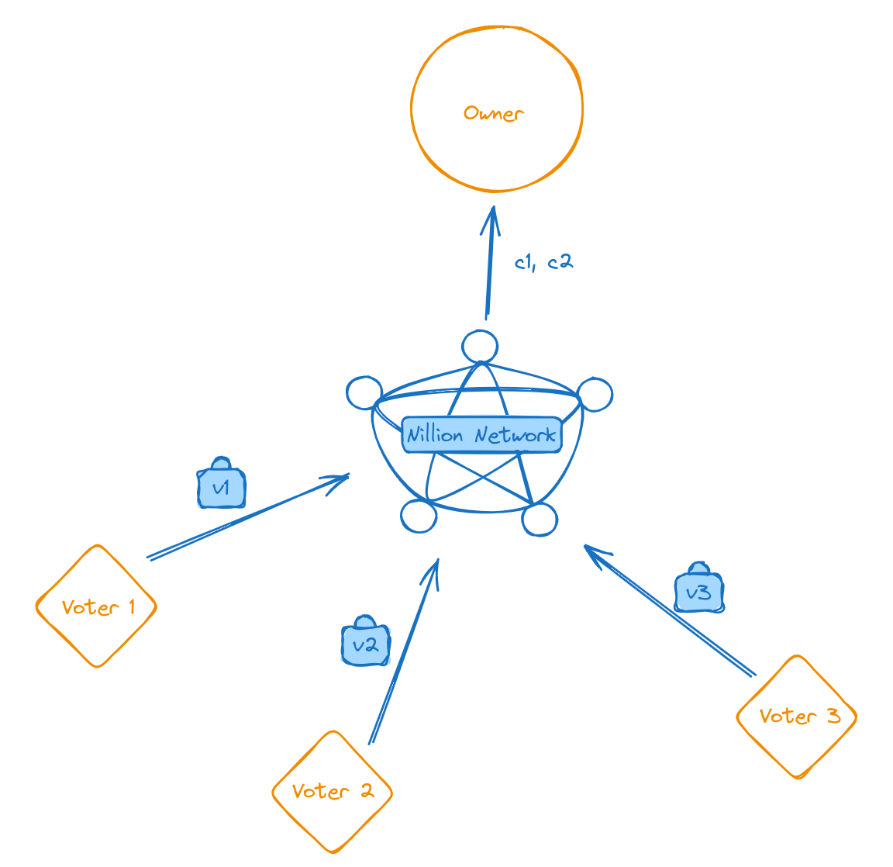

# Voting tutorial

## Introduction

This tutorial provides a generic template for creating several voting systems in `PyNada`. We will explore five types of voting systems: Plurality, Range, Veto, Approval and Borda. For a more detailed exposition on the voting systems, we can refer to [[DTY21]](https://www.sciencedirect.com/science/article/abs/pii/S0957417420310964). The tutorial is specifically focused on PyNada programs for these voting systems. If you want to run the voting programs in `nillion-devnet`, check the [README](README.md) file.

Let us consider the following voting scenario: three voters and two potential candidates. Voters transmit their votes to the Nillion Network in a secret-shared form, which processes the votes for each candidate without having access to their underlying values. The result of the computation is then transmitted to the owner of the voting system, who is able to reconstruct the result and read the winner.

<div style="text-align:center">
    
    <p>Architecture example.</p>
</div>

## Voting systems

Let us first define the voting systems we are aiming at. Currently, PyNada does not support the input as zero. For this reason, we shift the input votes by one when compared to the description in [[DTY21]](https://www.sciencedirect.com/science/article/abs/pii/S0957417420310964).

#### Plurality vote

**Definition:** Each voter votes for their preferred candidate. They assign a score of 2 to their preferred candidate and a score of 1 to all others.

>🤓 More specifically, we have the following  constraints:
>1. Vote $v_i = (c_1, c_2)$ where $c_j \in \{1,2\}$ and $c_1 + c_2 = 3$, for all $i\in[2]$.
>2. Candidate winner: $\text{arg max} (C_1, C_2) = \text{arg max}(\sum v_i)$.

#### Range vote

**Definition:** Each voter gives a score, ranging from 1 to a public predetermined value L, to each candidate. They assign a higher score to their preferred candidates.

>🤓 More specifically, we have the following constraints:
>1. Vote $v_i = (c_1, c_2)$ where $c_j \in \{1,\ldots, L\}$ for all $i\in[2]$.
>2. Candidate winner: $\text{arg max} (C_1, C_2) = \text{arg max} (\sum v_i)$.

#### Approval vote

**Definition:** Each voter approves up to K candidates. They assign a score of 2 to up to K candidates and a score of 1 to all others.

>🤓 More specifically, we have the following constraints for a scenario where there are 4 candidates and $K=2$:
>1. Vote $v_i = (c_1, c_2, c_3, c_4)$ where $c_j\in\{1,2\}$ and $$c_1 + c_2 + c_3 + c_4 = 6\,\, (= K*2 + (4-K)).$$   
>2. $K$ candidates win: $\text{arg max} (C_1, C_2, C_3, C_4) = \text{arg max} (\sum v_i)$.

#### Veto vote

**Definition:** Each voter chooses his least preferred candidate. They assign a score of 1 to their least preferred candidate and a score of 2 to all others.

>🤓 More specifically, we have the following constraints:
>1. Vote $v_i = (c_1, c_2)$ where $c_j \in \{1,2\}$ and $c_1 + c_2 = 3$, for all $i\in[2]$. Note that this system is only equivalent to the Plurality system in the two candidate setting.
>2. Candidate winner: $\text{arg max} (C_1, C_2) = \text{arg max} (\sum v_i)$.

#### Borda vote

**Definition:** Each voter ranks the candidates in preferred order. For M candidates, the most favourite candidate is assigned the score M and the least favourite is assigned 1.

>🤓 More specifically, we have the following constraints when $M=4$:
>1. Vote $v_i = (c_1, c_2, c_3, c_4)$ where $c_j\in\{1, 2, 3, 4\}$ and $c_k ≠ c_l$ $\forall i≠j$.
>2. Candidate winner: $\text{arg max} (C_1, C_2) = \text{arg max} (\sum v_i)$.

Each voting system have their constraints and can be applied to different scenarios. In the following sections, we will explore how these can be executed by a PyNada program.

## Honest voters

We start with a simple program as a warm-up. We assume voters are honest and provide sound input votes, which simplifies the requirements. 

Under this assumption, **all** the above voting systems can be reduced to **one** simple program where the votes are added for each candidate. The only difference between these voting systems is the input and output interpretation. 

### Hard-coded example

Let us start with a simple program with 3 voters and 2 candidates. Recall that the following program can be applied to any type of voting system described in the previous [chapter](#voting-systems).

Program: [voting_honest_1.py](../../programs/voting_honest_1.py)
```python 
"""
PROGRAM 1

nr of voters: m = 3
nr of candidates: n = 2
"""
from nada_dsl import *

def nada_main():

	# 1. Parties initialization
    voter0 = Party(name="Voter0")
    voter1 = Party(name="Voter1")
    voter2 = Party(name="Voter2")
    outparty = Party(name="OutParty") 

	# 2. Inputs initialization
    ## Votes from voter 0
    v0_c0 = SecretUnsignedInteger(Input(name="v0_c0", party=voter0))
    v0_c1 = SecretUnsignedInteger(Input(name="v0_c1", party=voter0))
    ## Votes from voter 1
    v1_c0 = SecretUnsignedInteger(Input(name="v1_c0", party=voter1))
    v1_c1 = SecretUnsignedInteger(Input(name="v1_c1", party=voter1))
    ## Votes from voter 2
    v2_c0 = SecretUnsignedInteger(Input(name="v2_c0", party=voter2))
    v2_c1 = SecretUnsignedInteger(Input(name="v2_c1", party=voter2))

	# 3. Computation
    ## Add votes for candidate 0
    result_c0 = v0_c0 + v1_c0 + v2_c0
    ## Add votes for candidate 1
    result_c1 = v0_c1 + v1_c1 + v2_c1
    
    # 4. Output
    result_c0 = Output(result_c0, "final_vote_count_c0", outparty)
    result_c1 = Output(result_c1, "final_vote_count_c1", outparty)

    return [result_c0, result_c1]
```

Let us breakdown the above program 1. All PyNada programs get compiled from the `nada_main()` function which can be divided in four major sections:

1. **Parties initialization:** all parties involved in the computation should be initialized to allow them to either provide some input or to receive the output of a computation. In our voting example, we have 3 parties that will provide inputs and 1 party receiving the result.

```python
    voter0 = Party(name="Voter0")
    voter1 = Party(name="Voter1")
    voter2 = Party(name="Voter2")
    outparty = Party(name="OutParty") 
```

> 💡 The parties created within PyNada are just placeholders identified by a name tag. Real input parties are assigned to the placeholders only when a program is run in the network.


2. **Inputs initialization:** after specifying the parties, we can use the `Input` function to assign inputs to specific parties. Then, we need to identify the type of the input. In our example, we use `SecretUnsignedInteger`.

```python
    ## Votes from voter 0
    v0_c0 = SecretUnsignedInteger(Input(name="v0_c0", party=voter0))
    v0_c1 = SecretUnsignedInteger(Input(name="v0_c1", party=voter0))
    ## Votes from voter 1
    v1_c0 = SecretUnsignedInteger(Input(name="v1_c0", party=voter1))
    v1_c1 = SecretUnsignedInteger(Input(name="v1_c1", party=voter1))
    ## Votes from voter 2
    v2_c0 = SecretUnsignedInteger(Input(name="v2_c0", party=voter2))
    v2_c1 = SecretUnsignedInteger(Input(name="v2_c1", party=voter2))
```

3. **Computation:** we can use all the initialized inputs and other elements to proceed with some computation. In our case, we simply add all the votes for candidate 0 and all the votes for candidate 1 separately.

```python
    ## Add votes for candidate 0
    result_c0 = v0_c0 + v1_c0 + v2_c0
    ## Add votes for candidate 1
    result_c1 = v0_c1 + v1_c1 + v2_c1
```

4. **Output:** after the logic bulk we can output multiple values using the `Output` function and returning the list of output elements. 

```python
    result_c0 = Output(result_c0, "final_vote_count_c0", outparty)
    result_c1 = Output(result_c1, "final_vote_count_c1", outparty)

    return [result_c0, result_c1]
```

The above program 1 requires hard-coding every voter, vote and candidates’ result. In case we have a big number of voters and candidates, we need to use more handy methods. Next, we show two approaches on how to generalize the above program. 

### Compiled-time `for` loops

We can make use of the Python run-time `for` loop to unroll the variables and create them for us. 


> ⚠️  Please note that <strong>PyNada does not currently support run-time for loops</strong>. In PyNada, Python loops are executed solely at compile time. Consequently, any for loop will not run during program execution and will lack access to input and computed variables, as these are only defined at run-time.

Below, program 2 shows how we could use compiled-time `for` loops to assist us creating all parties, input votes and building the computation section. 

Program: [voting_honest_2.py](../../programs/voting_honest_2.py)
```python
"""
PROGRAM 2

nr of voters: m = 5
nr of candidates: n = 3
"""
from nada_dsl import *

def nada_main():
    
    # 0. Compiled-time constants
    nr_voters = 3
    nr_candidates = 2

    # 1. Parties initialization
    voters = []
    for i in range(nr_voters):
        voters.append(Party(name="Voter" + str(i)))
    outparty = Party(name="OutParty")

    # 2. Inputs initialization
    votes_per_candidate = []
    for c in range(nr_candidates):
        votes_per_candidate.append([])
        for v in range(nr_voters):
            votes_per_candidate[c].append(SecretUnsignedInteger(Input(name="v" + str(v) + "_c" + str(c), party=voters[v])))

    # 3. Computation
    results = []
    for c in range(nr_candidates):
        result = votes_per_candidate[c][0]
        for v in range(1, nr_voters):
            ## Add votes for candidate c
            result += votes_per_candidate[c][v]
        # 4. Output
        results.append(Output(result, "final_vote_count_c" + str(c), outparty))

    return results
```
> 🔍 It is interesting to observe that the [MIR](https://docs.nillion.com/concepts#programs) representation of both programs (1 and 2) are exactly the same. You can inspect MIR files in the  [`programs-compiled`](/nillion-python-starter/programs-compiled/) folder.

Let us breakdown the above program 2.

0. **Compiled-time constants:** we can initialize compiled-time constants and use them for compiled-time related tasks. In our example, both `nr_votes` and `nr_candidates` are used to specify the length of the compiled-time `for` loop unrolling.

```python
	nr_voters = 3
    nr_candidates = 2
```

1. **Parties initialization:** the compiled-time `for` loop is used here to create a python list of parties. 
```python
    # 1. Parties initialization
    voters = []
    for i in range(nr_voters):
        voters.append(Party(name="Voter" + str(i)))
    outparty = Party(name="OutParty")
```
After running the above lines, the variable `voters` is a list containing the different voters:

```python
voters = [Party(name="Voter0"), Party(name="Voter1"), Party(name="Voter0")]
```
2. **Inputs initialization:** the compiled-time `for` loop is used here to create a python list of lists with all the votes for each candidate. 

```python
    # 2. Inputs initialization
    votes_per_candidate = []
    for c in range(nr_candidates):
        votes_per_candidate.append([])
        for v in range(nr_voters):
            votes_per_candidate[c].append(SecretUnsignedInteger(Input(name="v" + str(v) + "_c" + str(c), party=voters[v])))
```
After running the above lines, the variable `votes_per_candidate` should have the following structure:

```python
    votes_per_candidate = [[v0_c0, v1_c0, v2_c0], 
						   [v0_c1, v1_c1, v2_c1]]
    """
    where vi_cj = SecretUnsignedInteger(Input(name="vi_cj", party=voters[i]))]
    """
```
3. **Computation:** at this point we use the compiled-time `for` loop to create the expression that represents the votes for each candidate.

```python
    # 3. Computation
 	results = []
    for c in range(nr_candidates):
        result = votes_per_candidate[c][0]
        for v in range(1, nr_voters):
			## Add votes for candidate c
            result += votes_per_candidate[c][v]
```

Let use explicitly show how the `result` variable is updated. We consider the case of the first candidate `c = 0`:

```python
    # Initialization
    result = votes_per_candidate[0][0] # = v0_c0
    # for v = 1
    result = votes_per_candidate[0][0] 
                    + votes_per_candidate[0][1] 
    # for v = 2
    result = votes_per_candidate[0][0] 
                    + votes_per_candidate[0][1]
                    + votes_per_candidate[0][2]
```

> ⚠️ Note that the variable `result` is **not updated** during the execution of the program. In fact, the bytecode generated does not have the concept of variables. This process only builds the intended expression for each candidate. 

4. **Output:** for each candidate, the `result` variable is appended into the list of final results `results`, which is the list to be returned.

```python
    # 3. Computation
 	results = []
        ...
		# 4. Output
        results.append(Output(result, "final_vote_count_c" + str(c), outparty))

    return results
```

The `results` list is as follows: 

```python
results = [Output(votes_per_candidate[0][0] 
                + votes_per_candidate[0][1]
                + votes_per_candidate[0][2], "final_vote_count_c0", outparty),
           Output(votes_per_candidate[1][0] 
                + votes_per_candidate[1][1]
                + votes_per_candidate[1][2], "final_vote_count_c1", outparty)]
```

### Functional programming

PyNada provides a set of tools to code functional type programs. More specifically, it supports `zip`, `map` and `reduce` over two elements we haven’t come across before:

- `Array`: a fixed-sized object that holds basic types (e.g. `SecretInteger`, `SecretUnsignedInteger`)
- Nada functions: functions to be executed during run-time. These receive a special annotator `@nada_fn`.

```python
"""
PROGRAM 3

nr of voters: m = 5
nr of candidates: n = 3
"""
from nada_dsl import *

def nada_main():

    # 0. Compiled-time constants
    nr_candidates = 3

    # 1. Parties initialization
    voter1 = Party(name="Voter1")
    voter2 = Party(name="Voter2")
    voter3 = Party(name="Voter3")
    voter4 = Party(name="Voter4")
    voter5 = Party(name="Voter5") 
    outparty = Party(name="OutParty") 
		
    # 2. Inputs initialization
    vote1 = Array(SecretInteger(Input(name="Voter1", party=voter1)), size=nr_candidates)
    vote2 = Array(SecretInteger(Input(name="Voter2", party=voter2)), size=nr_candidates)	
    vote3 = Array(SecretInteger(Input(name="Voter3", party=voter3)), size=nr_candidates)	
    vote4 = Array(SecretInteger(Input(name="Voter4", party=voter4)), size=nr_candidates)	
    vote5 = Array(SecretInteger(Input(name="Voter5", party=voter5)), size=nr_candidates)

    # 3. Computation
    @nada_fn
    def add(a: SecretInteger, b: SecretInteger) -> SecretInteger:
        return a + b

    final_count = vote1
                    .zip(vote2)
                    .map(add)
                    .zip(vote3)
                    .map(add)
                    .zip(vote4)
                    .map(add)
                    .zip(vote5)
                    .map(add)

    # 4. Output
    final_count = Output(final_count, "final_vote_count", outparty)
    return [final_count]
```

## Dishonest voters

In the real world, we cannot expect input parties to follow the rules of the voting system. The previous programs (1, 2 and 3) were simply adding the input elements provided by the input parties. This means voters could pump the classification of their preferred candidate. Considering the plurality voting system, in case voter 1 prefers candidate 1, it can input  `v1_c0 = 1` and `v1_c1 = 10` instead of providing the (sound) value $2$. 

We can avoid this scenario by checking within the PyNada program that inputs are sound. At this point we can have two types of programs:

- *Dishonest with abort:* in this scenario voters can provide invalid inputs and the program is able to identify dishonest input parties. However, it does not guarantee correctness of result if there are dishonest input parties.
- *Robust dishonest:* in this scenario voters can also provide invalid inputs and the program is also able to identify dishonest input parties. In this case, the program guarantee correctness of result if there are dishonest input parties.

Below is a summary of the features for each variant.


| Features    | Honest  | Dishonest with abort | Robust dishonest |
| --- | --- | --- | --- |
| Allow invalid input | ❌ | ✅ | ✅ |
| Identify cheaters | ❌ | ✅ | ✅ |
| Correctness guaranteed | ❌ | ❌ | ✅ |

Each type of voting system has different ways to identify input soundness. For the sake of brevity, we show two PyNada programs for the **plurality voting system**: dishonest with abort setting and robust dishonest setting.

### Plurality | Dishonest with abort

We recall that the plurality voting system requires the following constraint for $M$ candidates:

- Vote $v_i = (c_1, \dots, c_M)$ where $c_j \in \{1,2\}$ and $c_1 + \ldots + c_M = M + 1$.

This requires us to check two rules:

1. Check sum: for every voter $v_i$, the addition of its votes must be exactly $M+1$
2. Check product: every $c_j\in\{1,2\}$. We can check this by computing the expression $$(1-c_j)\times(2-c_j)$$and check if it is equal to zero. The above expression is equal to zero if and only if $c_j\in\{1,2\}$.

For three voters and following the notation of Program 1, we code the checks as follows:

1. Check sum:

```python
    # Check votes:
    #    1. Sum
    # Voter 0
    check_v0_sum = v0_c0 + v0_c1
    # Voter 1
    check_v1_sum = v1_c1 + v1_c2
    # Voter 2
    check_v2_sum = v2_c1 + v2_c2
```

2. Check product:

```python
    #   2. Product
    # Voter 0
    check_v0_c0_product = (UnsignedInteger(1) - v0_c0)*(UnsignedInteger(2) - v0_c0)
    check_v0_c1_product = (UnsignedInteger(1) - v0_c1)*(UnsignedInteger(2) - v0_c1)
    # Voter 1
    check_v1_c0_product = (UnsignedInteger(1) - v1_c0)*(UnsignedInteger(2) - v1_c0)
    check_v1_c1_product = (UnsignedInteger(1) - v1_c1)*(UnsignedInteger(2) - v1_c1)
    # Voter 2
    check_v2_c0_product = (UnsignedInteger(1) - v2_c0)*(UnsignedInteger(2) - v2_c0)
    check_v2_c1_product = (UnsignedInteger(1) - v2_c1)*(UnsignedInteger(2) - v2_c1)
```
Below, we put together the above two checks with our protocol:

```python
"""
PROGRAM 4

nr of voters: m = 3
nr of candidates: n = 2
"""
from nada_dsl import *

def nada_main():

    # 1. Parties initialization
    voter0 = Party(name="Voter0")
    voter1 = Party(name="Voter1")
    voter2 = Party(name="Voter2")
    outparty = Party(name="OutParty") 

    # 2. Inputs initialization
    ## Votes from voter 0
    v0_c0 = SecretUnsignedInteger(Input(name="v0_c0", party=voter0))
    v0_c1 = SecretUnsignedInteger(Input(name="v0_c1", party=voter0))
    ## Votes from voter 1
    v1_c0 = SecretUnsignedInteger(Input(name="v1_c0", party=voter1))
    v1_c1 = SecretUnsignedInteger(Input(name="v1_c1", party=voter1))
    ## Votes from voter 2
    v2_c0 = SecretUnsignedInteger(Input(name="v2_c0", party=voter2))
    v2_c1 = SecretUnsignedInteger(Input(name="v2_c1", party=voter2))

    # 3. Computation
    ## Add votes for candidate 0
    result_c0 = v0_c0 + v1_c0 + v2_c0
    ## Add votes for candidate 1
    result_c1 = v0_c1 + v1_c1 + v2_c1

    # Check votes:
    #    1. Sum
    # Voter 0
    check_v0_sum = v0_c0 + v0_c1
    # Voter 1
    check_v1_sum = v1_c1 + v1_c2
    # Voter 2
    check_v2_sum = v2_c1 + v2_c2
    #   2. Product
    # Voter 0
    check_v0_c0_product = (UnsignedInteger(1) - v0_c0)*(UnsignedInteger(2) - v0_c0)
    check_v0_c1_product = (UnsignedInteger(1) - v0_c1)*(UnsignedInteger(2) - v0_c1)
    # Voter 1
    check_v1_c0_product = (UnsignedInteger(1) - v1_c0)*(UnsignedInteger(2) - v1_c0)
    check_v1_c1_product = (UnsignedInteger(1) - v1_c1)*(UnsignedInteger(2) - v1_c1)
    # Voter 2
    check_v2_c0_product = (UnsignedInteger(1) - v2_c0)*(UnsignedInteger(2) - v2_c0)
    check_v2_c1_product = (UnsignedInteger(1) - v2_c1)*(UnsignedInteger(2) - v2_c1)
    
    # 4. Output
    return [
        Output(result_c0, "final_vote_count_c0", outparty), 
        Output(result_c1, "final_vote_count_c1", outparty), 
        Output(check_v0_sum, "v0_sum", outparty),
        Output(check_v1_sum, "v1_sum", outparty),
        Output(check_v2_sum, "v2_sum", outparty),
        Output(check_v0_c0_product, "v0_c0_prod", outparty),
        Output(check_v0_c1_product, "v0_c1_prod", outparty),
        Output(check_v1_c0_product, "v1_c0_prod", outparty),
        Output(check_v1_c1_product, "v1_c1_prod", outparty),
        Output(check_v2_c0_product, "v2_c0_prod", outparty),
        Output(check_v2_c1_product, "v2_c1_prod", outparty),
    ]
```

Similarly, we can utilize compiled-time `for` loops and **Python functions** to streamline the above code, particularly when scaling the number of voters and candidates.

>💡 In addition to compiled-time `for` loops, leveraging **Python functions** can lead to more organized and cleaner code. Python functions are executed by the interpreter during compilation and cannot rely on runtime variables. In contrast, **Nada functions** rely on run-time variables and are only executed during run-time. This distinction becomes apparent when comparing with the example provided in program 3.

Program: [voting_dishonest_abort_5.py](../../programs/voting_dishonest_abort_5.py)
```python
"""
PROGRAM 5

nr of voters: m = 3
nr of candidates: n = 2
"""
from nada_dsl import *

def initialize_voters(nr_voters):
    """
    Initializes the list of voters with unique identifiers.

    Args:
    nr_voters (int): Number of voters.

    Returns:
    list: List of Party objects representing each voter.
    """
    voters = []
    for i in range(nr_voters):
        voters.append(Party(name="Voter" + str(i)))

    return voters

def inputs_initialization(nr_voters, nr_candidates, voters):
    """
    Initializes the input for each candidate, collecting votes from each voter securely.

    Args:
        nr_voters (int): Number of voters.
        nr_candidates (int): Number of candidates.

    Returns:
        list: List of lists containing SecretUnsignedInteger objects representing votes per candidate.
    """
    votes_per_candidate = []
    for c in range(nr_candidates):
        votes_per_candidate.append([])
        for v in range(nr_voters):
            votes_per_candidate[c].append(SecretUnsignedInteger(Input(name="v" + str(v) + "_c" + str(c), party=voters[v])))

    return votes_per_candidate

def count_votes(nr_voters, nr_candidates, votes_per_candidate, outparty):
    """
    Counts the votes for each candidate.

    Args:
        nr_voters (int): Number of voters.
        nr_candidates (int): Number of candidates.
        votes_per_candidate (list): List of lists containing SecretUnsignedInteger objects representing votes per candidate.

    Returns:
        list: List of Output objects representing the final vote count for each candidate.
    """
    votes = []
    for c in range(nr_candidates):
        result = votes_per_candidate[c][0]
        for v in range(1, nr_voters):
            result += votes_per_candidate[c][v]
        votes.append(Output(result, "final_vote_count_c" + str(c), outparty))

    return votes

def fn_check_sum(nr_voters, nr_candidates, votes_per_candidate, outparty):
    """
    Verifies the sum of votes for each voter to ensure correctness.

    Args:
        nr_voters (int): Number of voters.
        nr_candidates (int): Number of candidates.
        votes_per_candidate (list): List of lists containing SecretUnsignedInteger objects representing votes per candidate.

    Returns:
        list: List of Output objects representing the sum verification for each voter.
    """
    check_sum = []
    for v in range(nr_voters):
        check = votes_per_candidate[0][v]
        for c in range(1, nr_candidates):
            vote_v_c = votes_per_candidate[c][v]
            check += vote_v_c
        check_sum.append(Output(check, "check_sum_v" + str(v), outparty))

    return check_sum

def fn_check_prod(nr_voters, nr_candidates, votes_per_candidate, outparty):
    """
    Verifies the product of vote values for each voter and candidate.

    Args:
        nr_voters (int): Number of voters.
        nr_candidates (int): Number of candidates.
        votes_per_candidate (list): List of lists containing SecretUnsignedInteger objects representing votes per candidate.

    Returns:
        list: List of Output objects representing the product verification for each voter and candidate.
    """
    check_prod = []
    for v in range(nr_voters):
        for c in range(nr_candidates):
            vote_v_c = votes_per_candidate[c][v]
            check_v_c_product = (UnsignedInteger(1) - vote_v_c)*(UnsignedInteger(2) - vote_v_c)
            check_prod.append(Output(check_v_c_product, "check_prod_v" + str(v) + "_c" + str(c), outparty))
		
    return check_prod

def nada_main():

    # 0. Compiled-time constants
    nr_voters = 3
    nr_candidates = 2

    # 1. Parties initialization
    voters = initialize_voters(nr_voters)
    outparty = Party(name="OutParty")

	# 2. Inputs initialization
    votes_per_candidate = inputs_initialization(nr_voters, nr_candidates, voters)
    
    # 3. Computation
    # Count the votes
    votes = count_votes(nr_voters, nr_candidates, votes_per_candidate, outparty)
    # Check input soundness
    check_sum = fn_check_sum(nr_voters, nr_candidates, votes_per_candidate, outparty)
    check_prod = fn_check_prod(nr_voters, nr_candidates, votes_per_candidate, outparty)

    # 4. Output
    # Concatenate lists
    results = votes + check_sum + check_prod 
    return results
```

### Plurality | Robust dishonest

In the previous section, we were only able to identify cheating voters. Moreover, we were not able to recover the final result without the influence of cheating voters. In this section, we propose a way to achieve that with some features like `if_else` and comparisons `<`. We use unsigned integers (`UnsignedInteger` type) to make the program simpler.

The 5 types of voting systems rely on **adding** all the votes. So, in case we have access to the votes of cheating voters, we can easily subtract them from the final result and retrieve the result without counting with cheaters’ votes. We can enforce that by adding the following piece of code to output the vote of a cheating voter:

```python
    # Voter 1 check sum
    comp_v1_sum = check_v1_sum <= UnsignedInteger(3) # nr_candidates + 1
    
    #    Candidate 0 check product
    comp_v1_c0_prod = check_v1_c0_product < UnsignedInteger(1)
    
    #    Candidate 1 check product
    comp_v1_c1_prod = check_v1_c1_product < UnsignedInteger(1)
    
    #    Candidate 0 reveal if voter 1 cheated
    if_sum_cheat_open_v1_c0 = comp_v1_sum.if_else(UnsignedInteger(0), v1_c0)
    if_prod_cheat_open_v1_c0 = comp_v1_c0_prod.if_else(
        comp_v1_c1_prod.if_else(
            UnsignedInteger(0),
            v1_c0
        ), 
        v1_c0
    )
                                                                            
    #    Candidate 1 reveal if voter 1 cheated
    if_sum_cheat_open_v1_c1 = comp_v1_sum.if_else(UnsignedInteger(0), v1_c1)
    if_prod_cheat_open_v1_c1 = comp_v1_c0_prod.if_else(
        comp_v1_c1_prod.if_else(
            UnsignedInteger(0),
            v1_c1
        ), 
        v1_c1
    )
```

In the code above, we start by checking if the value under `check_v1_sum` follows the required constraint (should be smaller than the number of candidates plus one). The result `comp_v1_sum` is a secret boolean that can then be used in conjunction with the `if_else` function. 

```python
    # Voter 1
    comp_v1_sum = check_v1_sum <= UnsignedInteger(3) # nr_candidates + 1
```

Based on the value of `comp_v1_sum`, we can either return the true value of a voter’s vote or a value `0` with no meaning. 

```python
    #    Candidate 0 reveal if voter 1 cheated
    if_sum_cheat_open_v1_c0 = comp_v1_sum.if_else(UnsignedInteger(0), v1_c0)
    ...
    #    Candidate 1 reveal if voter 1 cheated
    if_sum_cheat_open_v1_c1 = comp_v1_sum.if_else(UnsignedInteger(0), v1_c1)
    ...
```

Now, we check if the check product variables `check_v1_c0_product` and `check_v1_c1_product` are zero. Since we are using unsigned integers, than can be achieved by the `. < 1` operation. If that is the case, we use again `if_else` to return a value without meaning `0`, otherwise we return the true value of a voter’s vote. Note that we only reveal the votes in case any of the boolean values (`comp_v1_c0_prod` or `comp_v1_c1_prod`) is false. This is ensured by chaining `if_else` operations

```python
    #    Candidate 0 reveal if voter 1 cheated
    ...
    if_prod_cheat_open_v1_c0 = comp_v1_c0_prod.if_else(
        comp_v1_c1_prod.if_else(
            UnsignedInteger(0),
            v1_c0
        ), 
        v1_c0
    )
    #    Candidate 1 reveal if voter 1 cheated
    ...
    if_prod_cheat_open_v1_c1 = comp_v1_c0_prod.if_else(
        comp_v1_c1_prod.if_else(
            UnsignedInteger(0),
            v1_c1
        ), 
        v1_c1
    )
```

Then, we output the cheating conditions `comp_v1_sum`, `comp_v1_c0_prod` and `comp_v1_c1_prod` along with the values `if_sum_cheat_open_v1_c0`, `if_sum_cheat_open_v1_c1`, `if_prod_cheat_open_v1_c0` and `if_prod_cheat_open_v1_c1` .

Below, we put together the above two checks with our protocol. For readability purposes, we use a function `return_val_if_any_true(list_of_bool, val)` which returns the value `val` if at least on boolean in the list is false.

Program: [voting_dishonest_robust_6.py](../../programs/voting_dishonest_robust_6.py)
```python
"""
PROGRAM 6 

nr of voters: m = 3
nr of candidates: n = 2
"""
from nada_dsl import *

def return_val_if_any_true(list_of_bool, val):
    """
    Returns val if any boolean inside list_of_bool is false.

    Parameters:
    - list_of_bool (list of bool): List of boolean values to be checked.
    - val: Value to be returned if any boolean in the list is false.

    Returns:
    - val: If any boolean in the list is false.
    - 0: If none of the booleans in the list are false.
    """
    
    final_value = UnsignedInteger(0)
    for bool in list_of_bool:
        # Use if_else method to check if the current boolean is true,
        # if true, return val, otherwise return the current final_value
        final_value = bool.if_else(final_value, val) 

    return final_value

def initialize_voters(nr_voters):
    """
    Initialize voters with unique identifiers.

    Parameters:
    - nr_voters (int): Number of voters.

    Returns:
    - voters (list): List of Party objects representing voters.
    """
    voters = []
    for i in range(nr_voters):
        voters.append(Party(name="Voter" + str(i)))

    return voters

def inputs_initialization(nr_voters, nr_candidates, voters):
    """
    Initialize inputs for votes per candidate.

    Parameters:
    - nr_voters (int): Number of voters.
    - nr_candidates (int): Number of candidates.

    Returns:
    - votes_per_candidate (list): List of lists representing votes per candidate.
    """
    votes_per_candidate = []
    for c in range(nr_candidates):
        votes_per_candidate.append([])
        for v in range(nr_voters):
            votes_per_candidate[c].append(SecretUnsignedInteger(Input(name="v" + str(v) + "_c" + str(c), party=voters[v])))

    return votes_per_candidate

def count_votes(nr_voters, nr_candidates, votes_per_candidate, outparty):
    """
    Count votes for each candidate.

    Parameters:
    - nr_voters (int): Number of voters.
    - nr_candidates (int): Number of candidates.
    - votes_per_candidate (list): List of lists representing votes per candidate.

    Returns:
    - votes (list): List of Output objects representing vote counts for each candidate.
    """
    votes = []
    for c in range(nr_candidates):
        result = votes_per_candidate[c][0]
        for v in range(1, nr_voters):
            result += votes_per_candidate[c][v]
        votes.append(Output(result, "final_vote_count_c" + str(c), outparty))

    return votes

def fn_check_sum(nr_voters, nr_candidates, votes_per_candidate, outparty):
    """
    Check the sum of votes for each voter.

    Parameters:
    - nr_voters (int): Number of voters.
    - nr_candidates (int): Number of candidates.
    - votes_per_candidate (list): List of lists representing votes per candidate.

    Returns:
    - check_sum (list): List of Output objects representing the sum checks for each voter.
    - if_sum_cheat_open (list): List of Output objects representing revealed votes of cheating voters.
    """
    check_sum = []
    if_sum_cheat_open = []
    for v in range(nr_voters):
        check = votes_per_candidate[0][v]
        for c in range(1, nr_candidates):
            vote_v_c = votes_per_candidate[c][v]
            check += vote_v_c
            check_sum.append(Output(check, "check_sum_v" + str(v), outparty))
            # Reveal if cheat
            comp_v_sum = check <= UnsignedInteger(nr_candidates + 1)
            for c in range(nr_candidates):
                vote_v_c = votes_per_candidate[c][v]
                if_sum_cheat_open_v_c = comp_v_sum.if_else(UnsignedInteger(0), vote_v_c)
                if_sum_cheat_open.append(Output(if_sum_cheat_open_v_c, "if_sum_cheat_open_v" + str(v) + "_c" + str(c), outparty))

    return check_sum, if_sum_cheat_open

def fn_check_prod(nr_voters, nr_candidates, votes_per_candidate, outparty):
    """
    Check the product of votes for each voter.

    Parameters:
    - nr_voters (int): Number of voters.
    - nr_candidates (int): Number of candidates.
    - votes_per_candidate (list): List of lists representing votes per candidate.

    Returns:
    - check_prod (list): List of Output objects representing the product checks for each voter.
    - if_prod_cheat_open (list): List of Output objects representing revealed votes of cheating voters.
    """
    check_prod = []
    if_prod_cheat_open = []
    all_comp_prod = []
    for v in range(nr_voters):
        all_comp_v_prod = []
        for c in range(nr_candidates):
            vote_v_c = votes_per_candidate[c][v]
            check_v_c_product = (UnsignedInteger(1) - vote_v_c)*(UnsignedInteger(2) - vote_v_c)
            check_prod.append(Output(check_v_c_product, "check_prod_v" + str(v) + "_c" + str(c), outparty))
            # collect all reveal conditions
            comp_v_c_prod = check_v_c_product < UnsignedInteger(1)
            all_comp_v_prod.append(comp_v_c_prod)
        all_comp_prod.append(all_comp_v_prod)
    # reveal all votes from voter v if 
    for v in range(nr_voters):
        all_comp_v_prod = all_comp_prod[v]
        for c in range(nr_candidates):
            vote_v_c = votes_per_candidate[c][v]
            if_prod_cheat_open_v_c = return_val_if_any_true(all_comp_v_prod, vote_v_c)
            if_prod_cheat_open.append(Output(if_prod_cheat_open_v_c, "if_prod_cheat_open_v" + str(v) + "_c" + str(c), outparty))

    return check_prod, if_prod_cheat_open
				

def nada_main():

    # 0. Compiled-time constants
    nr_voters = 3
    nr_candidates = 2

    # 1. Parties initialization
    voters = initialize_voters(nr_voters)
    outparty = Party(name="OutParty")

	# 2. Inputs initialization
    votes_per_candidate = inputs_initialization(nr_voters, nr_candidates, voters)
    
    # 3. Computation
    # Count the votes
    votes = count_votes(nr_voters, nr_candidates, votes_per_candidate, outparty)
    # Check input soundness
    check_sum, if_sum_cheat_open = fn_check_sum(nr_voters, nr_candidates, votes_per_candidate, outparty)
    check_prod, if_prod_cheat_open = fn_check_prod(nr_voters, nr_candidates, votes_per_candidate, outparty)

    # 4. Output
    # Concatenate lists
    results = votes + check_sum + if_sum_cheat_open + check_prod + if_prod_cheat_open
    return results
```

## Extra tip

The above examples represent a scenario where the output is delivered to only one party. However, in some situations, we may want to output the same value to multiple parties. Usually, this can be done as follows:

```python
return [Output(value, "value_output", outparty1),
        Output(value, "value_output", outparty2)]
```

In case the number of output parties is big, we can make use of the Python interpreter to generate a list of outputs for us. Using the list of `voters` and `outparty` from program 6, in case we want to output the voting result to all voters we can do as follows:

```python
[Output(result, "final_vote_count_c" + str(c), p) for p in voters + [outparty]]
```

# References

[DTY21] [Fear not, vote truthfully: Secure Multiparty Computation of score based rules](https://www.sciencedirect.com/science/article/abs/pii/S0957417420310964), 2021